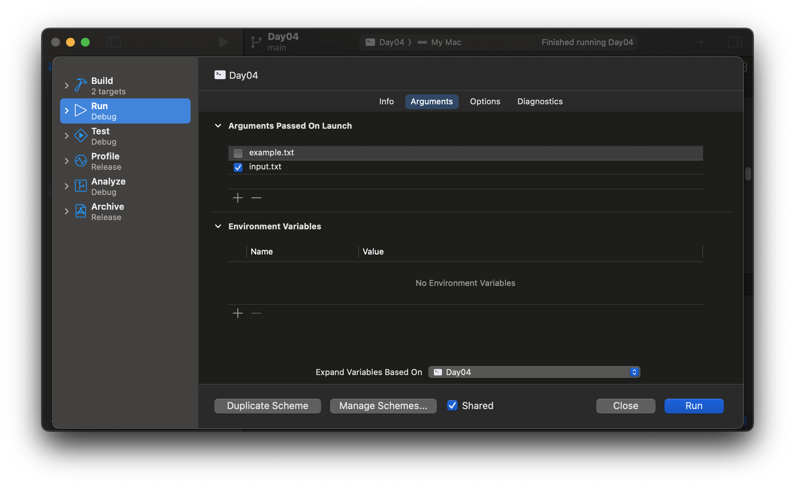
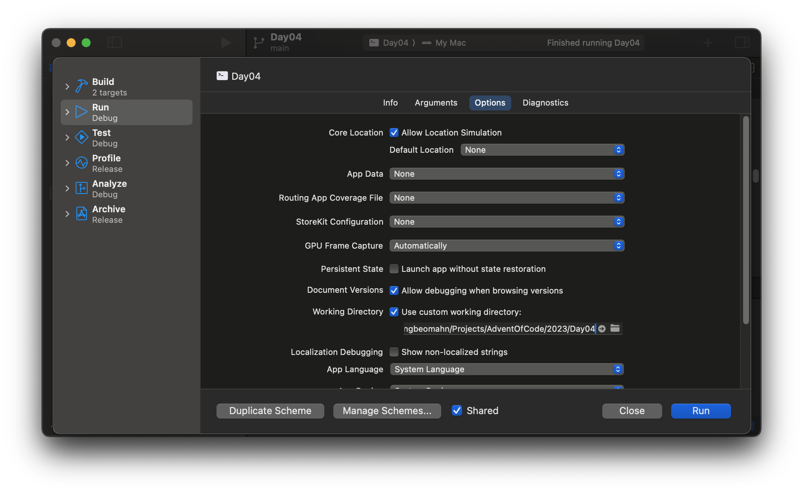
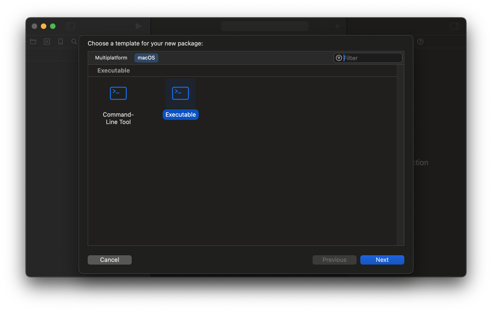

# [Swift](https://swift.org)로 풀어보는 [Advent of Code](https://adventofcode.com)


## 왜 Swift인가?

Swift는 AoC에서 인기있는 언어는 아닌 것 같다.  [Subreddit]()을 보면 가장 흔한 건 Python이고 C++, C#, Java, Kotlin좀 Typescript, PHP 등의 좀 익숙한 언어와 Haskell, AWK, M4, Perl 등의 낯선 언어를 사용한 풀이가 보인다.  이름도 생소한 언어나 엑셀 또는 종이와 연필로 풀었다는 경우도 봤지만 Swift로 된 풀이를 본 적은 없었다.  물론 내가 모든 풀이를 본 것은 아니기 때문에 어딘가에 존재할 가능성은 있을 것이다.

그럼에도 불구하고 Swift는 지금 내가 좋아하고 태동기부터 발전하는 과정을 지켜보면서 즐겨쓰는 언어이기 때문이다.

## 구조

이 저장소는 기본적으로 최상위에 연도별 디렉터리가 있고 그 안에 일자별 디렉터리가 있고 그 안에 Swift 패키지가 있는 형태로 구성한다.

```
+- 2023/
|  +- Day01/
|  |  +- README.md
|  |  +- Sources/
|  |  |  +- main.swift
|  |  |
|  |  +- Package.swift
|  |
|  +- Day02/
|  |  ...
|
+- 2022/
|  ...
```

물론 경우에 따라 예외는 있을 수 있다.  그럴 때는 해당 일자의 README.md 파일에 관련 내용을 설명하겠다.

## 실행

### Xcode

1. Xcode에서 원하는 연도의 일자 패키지 디렉터리를 연다.
1. ⌥키를 누른 상태에서 실행 버튼을 누르거나 ⌥⌘R 단축키를 누른다.
1. Arguments Passed On Launch 목록에 사용할 입력 파일 이름/경로들을 추가한다.

1. 파일 이름을 입력한 경우 Working Directory에서 Use custom working directory:에 체크하고 아래에 경로를 입력하거나 선택한다.

1. Run 버튼을 클릭한다.

### 터미널

소스 파일만 저장해서 실행하거나

```
swift <소스 경로>/main.swift <엽력 파일>
```

패키지 디렉터리로 이동 후 아래 명령으로 실행할 수 있다.

```
swift run Day<일자> <입력 파일>
```

## 팁

### Force unwrap `!`

일반적으로 force unwrap (!)의 사용은 권장되지 않지만 AoC의 문제처럼 입력 데이터가 잘 정의된 겅우는 적절히 사용하면 간결한 코드를 얻는 편리함이 있다.

### 컴파일러가 힘들어하면 도와주자


## 패키지 생성

1. Xcode 메뉴에서 File > New > Package... 또는 단축키 ⌃⇧⌘N 입력

2. macOS 탭에서 Executabl서 선택


Command Line Tool의 경우 ArgumentParser 캐키지 의존성이 추가된다.

